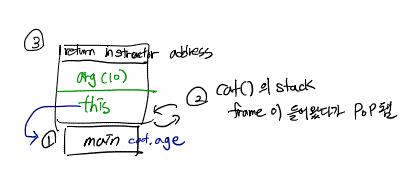

## call stack

```
int main(){

int a;
double b;

}
```

- a다음에 b가 순차적으로 스택에 쌓인다고 이해했을 것이지만 이렇게 동작하지 않는다.
- stackframe 단위로 쌓여가며, 함수 call 에따른 단위이다.

```

void foo(){

int a;
int b;

}

void bar(){

Cat cat;
Dog dog;

}

int main(){

int a;
double b;

foo();
bar();

}
```

- stack frame 으로 각 함수별로 따로 쓸 수 있다.

- 먼저 main 함수의 stackframe(a, b 변수) 가 쌓이고
  bar() 의 stackframe이 쌓이고, 처리된 후 사라진다.

- 즉! stack은 frame 단위로 function call에 따라 쌓여간다.

- 또한 stackframe과 함께 어떠한 정보가 같이 올라간다.
- argument와, return address (program counter)
- 따라서 함수가 끝난 후에 return address로 돌아가는 것!

## class 가 존재할 때 stack memory



```
class cat{
    public :
    Cat(){
        m_age = 1;
    };
    ~Cat();
    void addAge(int arg){
        m_age += arg;
    };

    private:
        int m_age;
};

int main(){
    Cat cat;
    cat.addAge(10);

    return 0;
}
```

- this 의 값을 통하여 cat.age의 값에 +1 해준다.
- this라는 pointer가 member 변수의 값을 address하기 위해 stack memory에 올라가는 것.

### 요약

1. high level memory 개념
2. stack 에 쌓이는 개념
3. 실제 하드웨어 쌓이는 격자의 메모리
4. 하나의 함수가 하나의 stackframe에 쌓이는 구조
5. this라는 포인터는 다른 stackframe의 자기 자신의 메모리 공간을 가리킴
